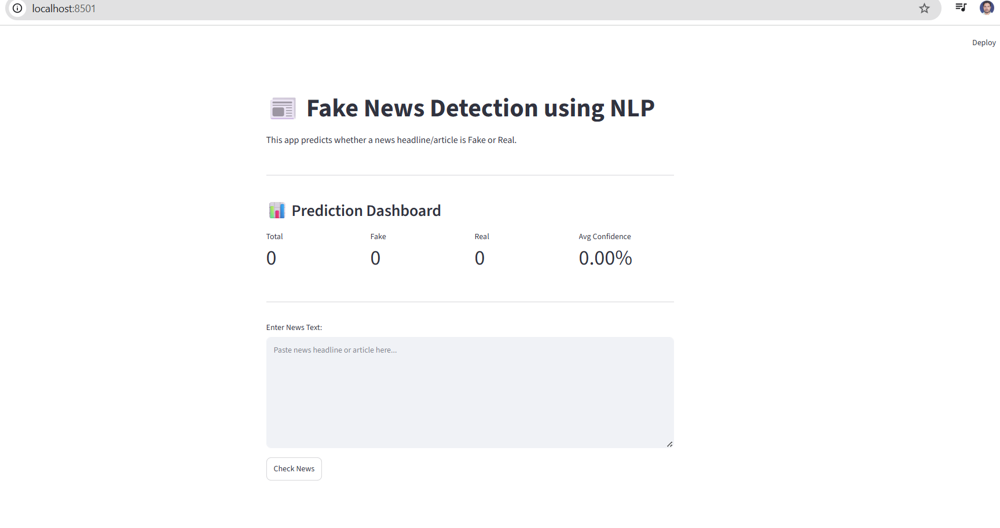
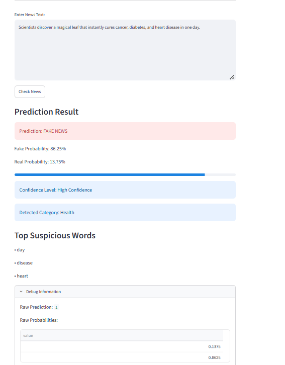

# Fake News Detection using NLP

## Overview

This project detects whether a news article or headline is **Fake News** or **Real News** using Natural Language Processing (NLP) and Machine Learning.

The system uses:

* TF-IDF Vectorization
* Logistic Regression Classifier
* Text Preprocessing
* Explainable Predictions
* Streamlit Interactive Dashboard

---

## Features

### Fake News Detection

Predicts whether a news article is Fake or Real.

### Confidence Score

Displays confidence percentage for the prediction.

### News Category Detection

Automatically identifies categories such as:

* Politics
* Health
* Technology
* Finance
* Sports

### Explainable AI

Displays top suspicious words contributing to fake news prediction.

### Analytics Dashboard

Tracks:

* Total Predictions
* Fake News Count
* Real News Count
* Average Confidence Score

---

## Dataset

Dataset Used:

WELFake Dataset

Source:

https://huggingface.co/datasets/davanstrien/WELFake

Dataset Size:

* Total Articles: 72,134
* Fake News: 37,106
* Real News: 35,028

Label Mapping:

* 0 = Real News
* 1 = Fake News

---

## Machine Learning Pipeline

News Text
↓
Text Cleaning
↓
Stopword Removal
↓
TF-IDF Vectorization
↓
Logistic Regression
↓
Prediction
↓
Confidence Score

---

## Model Performance

### Evaluation Results

Accuracy: 95.43%

Precision: 95.07%

Recall: 96.04%

F1 Score: 95.55%

---

## Technologies Used

* Python
* Pandas
* NumPy
* Scikit-Learn
* NLTK
* Joblib
* Streamlit
* Matplotlib
* Hugging Face Datasets

---

## Project Structure

fake-news-detection-nlp/

├── data/

├── models/

│ └── fake_news_model.pkl

├── train_model.py

├── app.py

├── requirements.txt

├── README.md

└── .gitignore

---

## Installation

### Clone Repository

git clone https://github.com/skdubey1983/fake-news-detection-nlp.git

cd fake-news-detection-nlp

### Create Virtual Environment

python -m venv venv

### Activate Environment

Windows

venv\Scripts\activate

### Install Dependencies

pip install -r requirements.txt

---

## Train Model

python train_model.py

---

## Run Application

streamlit run app.py

---

## Example Prediction

Input:

Scientists discover a magical leaf that instantly cures cancer, diabetes, and heart disease in one day.

Output:

Prediction: FAKE NEWS

Confidence: 86.25%

Category: Health

Top Suspicious Words:

* disease
* heart
* day

## Screenshots

### Dashboard

### Fake News Prediction

---

## Future Enhancements

* BERT Based Fake News Detection
* Real-Time News API Integration
* Multilingual News Detection
* Explainable AI Dashboard
* Cloud Deployment

---

## Author

Shiv Kishan Dubey and Sri Nath Dwivedi
(Industry Training - ASDL group)
AI/ML Project- Fake News Detection using NLP and Machine Learning
